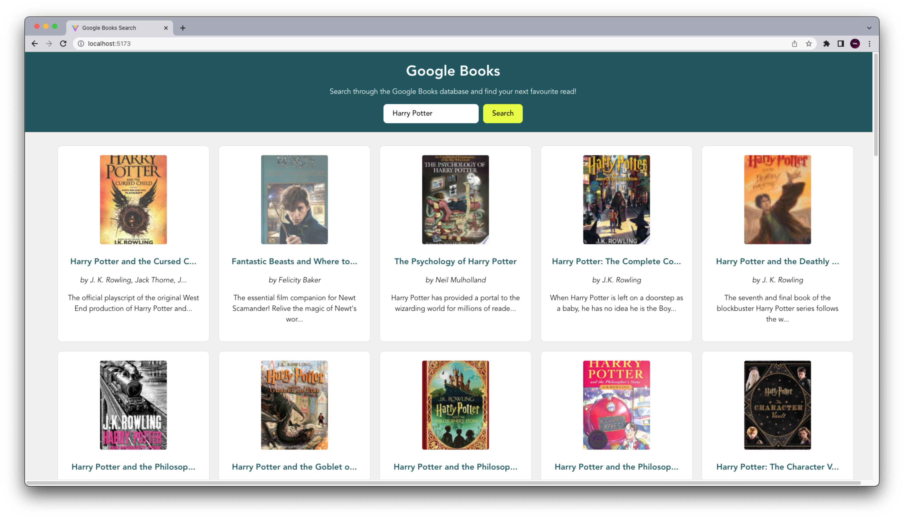
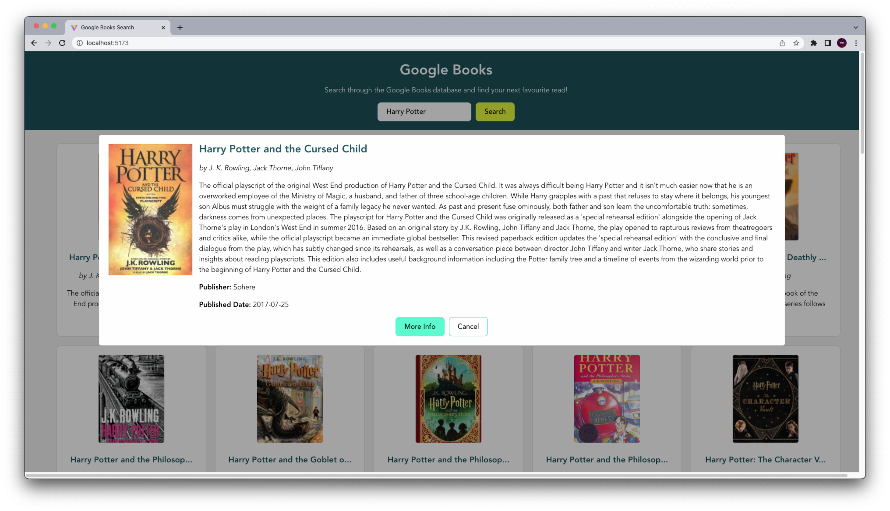

# Google Books Search

A Google Books search enginge built using React and SCSS (using BEM methodology). It retrives data from the Google Books API. The web app is responsive to different screensizes.

[View deployed App](https://google-books-one.vercel.app/)

## ScreenShots

## MVP

Create a page that allows users to search for books
Page should include the following:

- [x] Header section introducing the page
- [x] Form containing a text input and a submit / search button
- [x] A grid of books rendering the results of the query from the Google Books API

### BONUS

- [x] Give feedback to the user when no book results can be found for the query.
- [x] When a user clicks a book in the grid, a modal should appear with more information about the book.

## Features

- The app allows you to search through the Google API and returns up to 40 results for the query.
- It gives feedback to the user when no book results can be found for the query.
- When a user clicks a book in the grid, a modal appears with more book information and a direct link to the google books result.
- The results grid is responsive to different screen sizes.
- Each block has its own SCSS file, but makes use palette variables and @media queries.

## Challenges

- Transferring of data across components (prop drilling). This was resolved by using Context and easily accessing the values in the required components.
- Decluttering and organisation of Components and Containers.
- Separation of concerns - Through the code review, I was able to understand that I needed to create separate functions for specific tasks. This makes it easier to resolve bugs as they occur (unit testing).

## Additional Learning

- Truncation of text can also be done through CSS
- Keep code DRY by abstracting large pieces of duplicate code.

## Useful Resources

- [Truncating Long Text](https://javascript.info/task/truncate)
- [Google Books API no Auth link](https://developers.google.com/books/docs/v1/using#WorkingVolumes)
- [Using Async Await](https://dmitripavlutin.com/javascript-fetch-async-await/)

---

### Reachout

- [LinkedIn](https://au.linkedin.com/in/ayushjames)
- [Email](mailto:ayushpjames@gmail.com)
- [Portfolio]()
