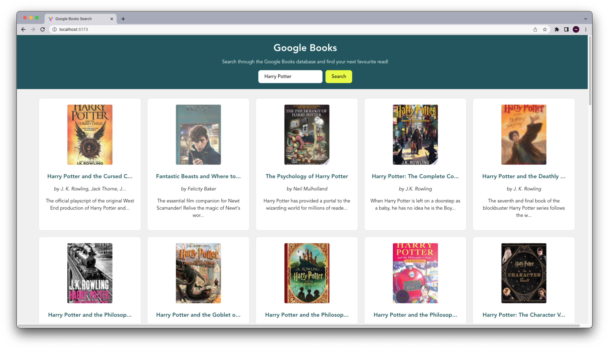
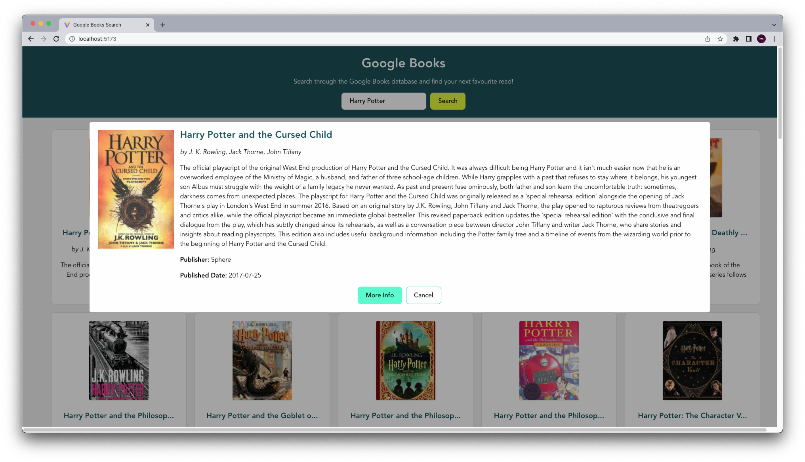

# Google Books Search

A Google Books API Search Engine built using React.

## ScreenShots

## Features

- The app allows you to search through the Google API and returns up to 40 results for the query.
- It gives feedback to the user when no book results can be found for the query.
- When a user clicks a book in the grid, a modal appears with more book information and a direct link to the google books result.
- The results grid is responsive to different screen sizes.
- Each block has its own SCSS file, but makes use palette variables and @media queries.

## Useful Resources

- [Truncating Long Text](https://javascript.info/task/truncate)
- [Google Books API no Auth link](https://developers.google.com/books/docs/v1/using#WorkingVolumes)
- [Using Async Await](https://dmitripavlutin.com/javascript-fetch-async-await/)

## Challenges

- Transferring of data across components - Next time might consider using the useContext Hook.
- Decluttering and organisation of Components and Containers.
